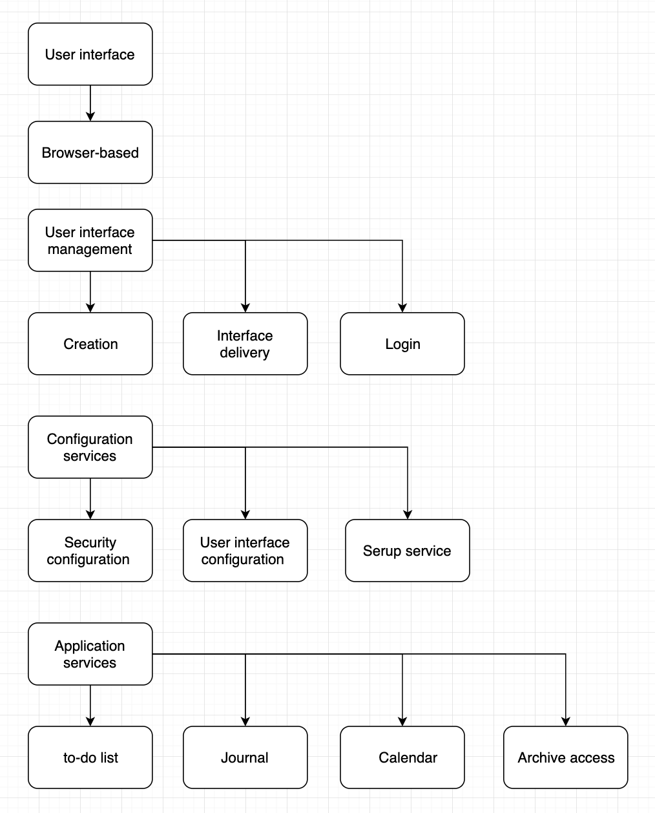

# Project-13 (myDay)

## Docker

To run this docker image on your terminal, please do the following:

1. First you need to pull the docker image and to do that type `docker pull rakilzzz/myday`
2. Rename the container to myday by typing `docker tag rakilzzz/myday myday`
3. Then type `docker images` or `docker image ls` to make sure you see two images, one named `rakilzzz/myday` and other one named `myday`
4. Once you see and verify the images, you can simply type `docker run -it -p 3000:3000 myday`
5. It will start the development server at port 3000, to view it on your brower go to http://localhost:3000

## Layered Software Architecture

1. Important qualities:

   - Product Lifetime: The purpose of myDay is to let people better organize their day to day lives. And since we are talking about productivity, we doubt that it will ever vanish from this world, hence myDay needs to be updated regularly so the users can use it with confidence and witout having to deal with any issues.

   - Number of Users: Since our target is students, teachers and anyone who deals with productivity online, we think the number of active users will grow quickly hence we need to make our product strong enough to handle the load.

2. Product Layers:

   - Browser-based
   - Authentication + user interaction management
   - Application-specific functionality
   - Database management

3. Diagram:

4. Technologies:

   - Database: Firestore & MongoDB
   - Authentication: Firebase > Email
   - Backend: NodeJS, Express
   - Frontend: ReactJS

## Idea:

The idea behind this app is to give the user full power to control their productivity dashboard. The user can add To-Dos, Events, have a personal journal to write down thier amazing ideas or thoughts, stay updated with the important current events etc.

## Prototype Live Link : https://myday-prototype.vercel.app/

## Steps:

1. Download the project or clone it from the terminal.
2. Once that's done, cd into `/client` folder.
3. If you don't have node installed on your machine, please visit https://nodejs.org/en/download/ and download it based on your operating system.
4. Run `npm install` to install all the required dependencies.
5. To view all components or create a new one, cd into `src/components` folder.
6. Finally, run `npm start` to start the development server.

## Team Info:

1. Alfredo Morales (Alfredo.Morales55@myhunter.cuny.edu): Likes to play Soccer ⛹️‍♂️ ⚽️!
2. Harold Peralta (haroldperalta93@gmail.com): Likes to build Computers 🛠 💻!
3. Robert Bangiyev (rbangiyev123@gmail.com): Likes to play Video Games 🕹 🎮!
4. Md Rakil Ahmed (rakilz.ahmed@gmail.com): Likes to De-bug things 🔨 ⚙️!
